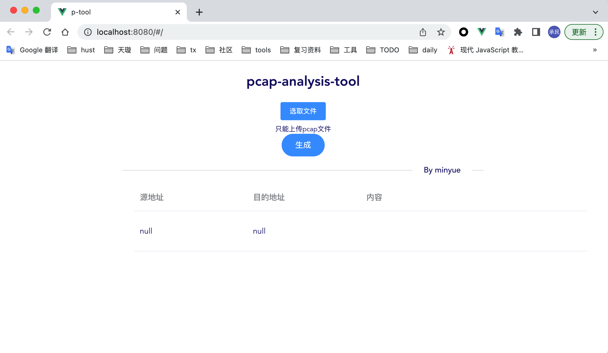

# Flask-vue-pcap-analysis
A single page application with Flask and Vue.

### 前言
这是一个前端用 Vue，后端用 Python 的 Web 框架 Flask 开发的sip/rtp协议数据包（pcap）解析工具。这个小项目作为自己毕业设计

课题来完成。感兴趣可以clone下来自己玩哈～

### 目录结构

先简单看一下项目的目录结构，backend 是 Flask 实现的服务端，frontend 是 Vue 实现的前端。

```
.
├── ./README.md
├── ./backend
│   ├── ./backend/app
│   └── ./backend/pcap-analysis.py
└── ./frontend
    ├── ./frontend/README.md
    ├── ./frontend/build
    ├── ./frontend/config
    ├── ./frontend/dist
    ├── ./frontend/index.html
    ├── ./frontend/node_modules
    ├── ./frontend/package-lock.json
    ├── ./frontend/package.json
    └── ./frontend/src
```
> Vue 是渐进式 JavaScript 框架。[Vue官网](https://cn.vuejs.org/)

> Flask 是一个使用 Python 编写的轻量级 Web 应用框架。[Flask 学习资源](https://dormousehole.readthedocs.io/en/latest/)

再来看一下目前代码的运行效果：

